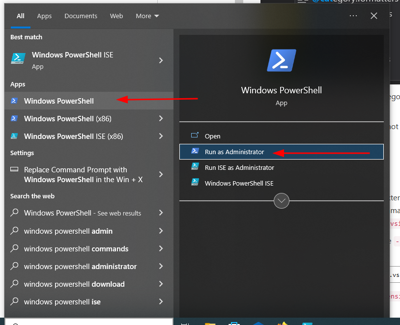
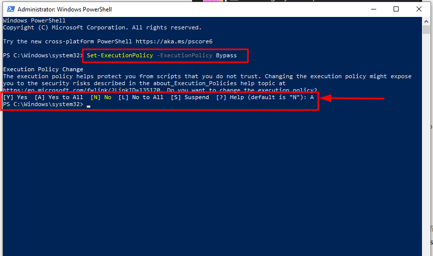

<div align=center>

# Script to install code editor and language 
 
</div>

- This is an **powershell script** for **Windows** which installs **Python** and **mingw (gcc, g++)**
- This script also installs **VS Code** as code editor with all required extensions.

***  ***

```
Tested on Microsoft Windows 10
```

*** ***

### How to run script

>>> Screenshots will be added in some time as some experiments are going on

Clone this repo

```
git clone https://github.com/TheProGhost/DevTools_AutoInstall.git
```

- Run powershell as Administrator 

<div align=center>



</div>

- Type below command in powershell and hit Enter

```
Set-ExecutionPolicy -ExecutionPolicy Bypass
```
- Then it will ask for choice. Press 'A' and hit Enter

<div align=center>


</div>

- Now go to the folder
```
cd DevTools_AutoInstall
```

- Now, run the script using following command and have some fun till it completes
```
.\devTools_Script.ps1
```

- Now, select for which language you want to install.
<div align=center>


</div>

- You can alsop enter multiple choices seperated by space
<div align=center>


</div>

- To update all installed packages write following command in **Powershell** running as administrator 
```
cup all
```